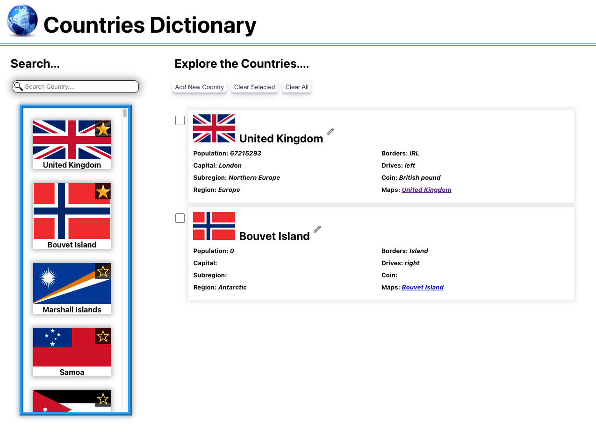
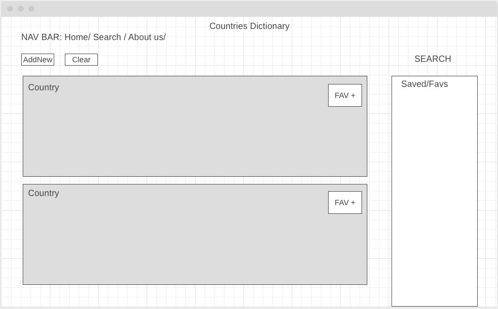
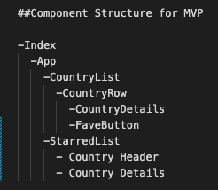

# Project-2-api-React-App
---

Developer: Tom Fairclough <br>
Technologies: HTML/CSS/JavaScript/React/Axios

## Description
- - -

This is my first project using React as part of the SEI GeneralAssembly Course. The task was to create a web application using ReactJS and an API of your choice that met the requirements of a provided specification.



## Deployment Link
- - - 

https://soft-frangollo-12d3ea.netlify.app/

## Technologies
- - -
This project utilised the following:
- **Code Editor:** VSCode
- **Programming Languages:** HTML, CSS, JavaScript, JSX
- **JS-Libaries:** React, Axios
- **Version Control:** Git & Git Hub Source Control
- **Design:** Wireframe.cc
- **Image Editors:** GNU Image Manipulation Programme

## Brief
- - - 

A tick denotes that the requirement has been delivered in this project release: 
### Goals
- &#x2611; Build a web application from scratch, without a starter codebase
- &#x2611; Use React with create-react-app to build your application.
- &#x2611; Plan your application using wireframes and User stories.
- &#x2611; Deploy your app online, where the rest of the world can access it.

### Technical Requirements
- &#x2611; As a User, I should be able to add a new item to a list
- &#x2611; As a User, I should be able to mark the item as complete/favorite/(watch, read, listen) later/flag/etc
- &#x2611; As a User, I should be able to edit an item from a list
- &#x2611; As a User, I should be able to remove an item from a list
- &#x2611; As a User, I should be able to clear/delete all items
- &#x2611; As a User, I should be able to clear/delete only marked items
- &#x2611; As a User, I should be able to fetch data from at least one 3rd party API using Axios or fetch.

### Optional Extras:
- &#x2611; Make the app Responsive 
- Use React Router to handle multiple views.
- Save the data to localStorage or an API
- Use a React component library like Ant Design, Bootstrap React, or Material UI
- Use 1 or more 3rd party API's with fetch or Axios
- Use a CSS library like Bootstrap (tutorial)


## Planning
- - -

My application is a country dictionary that allows a User to look up, favourite and edit details about countries. I wanted the interface to be simple and intuitive to use that was response to screen size and mobile devices. I produced a wireframe to plan the React components and wrote out pseudocode to help structure the project. 

With one week for development I focused on delivering the core technical requirements while ensuring the page and code could scale to the optional extras. I reserved time for both refactoring and documentation.

### Wireframe



### Component Structure 



##  Build Process

- - -
In this section I step through the build process, highlighting extracts from the code base:

- Created the core components in React and added placeholders for key functionalities. Added some basic formatting so that I had a basic page structure to work with.

- Added state to control variables for: 
    1. Input values
    2. Starred objects
    3. Element visibility conditions
    4. API data

    ```JavaScript
    class App extends Component{
      constructor(props) {
        super(props)
        this.state ={
          searchInput: '',
          allCountries: [],
          countriesToDisplay: [],
          starredList: [],
          removalList:[],
          inputVisibility: false,
        }
      }
    }
    ```

- Fetched the API data and stored the response in a state. This interacted with the search input allowing the User to search through existing country datsets. 

    ```JavaScript
    const countryURL = 'https://restcountries.com/v3.1/all'
    axios.get(countryURL).then(response => (this.setState({allCountries: response.data, countriesToDisplay: response.data})))
    ```

- Added various buttons to allow the User to interact with the page. These methods were passed as properties to the required components.

- Added CSS styling to the page using classes which included: A responsive layout; animations on interactive sections of the page; shadows to give depth, overflow scrolling containers and list elements to allow components to be added easily. 

    ```CSS
        .checkbox {
          position: absolute;
          top:0;
          left: -42px; 
          height: 20px;
          width: 20px;
          transition: 0.1s
        }

        .checkbox:hover {
          transform: scale(1.1);
        }

        .checkbox:active {
          transform: scale(1.05);
        }
    ```

- Allowed the User to add new coutries or edit existing content. Using conditional rendering I dynamically changed the page depending on the current state and action.

    ```JavaScript
        {this.state.inputVisibility && <AddNewCountryPopUp  newCountry={prepopulateInput}
                                                            editMode={this.state.editMode}
                                                            handleNewCountryInput={this.handleNewCountryInput}           
                                                            addNewCountrySubmit={this.inputPageSubmitClick}
                                                            handleFileUpload={this.handleFileUpload}
                                                            toggleInputFieldOff={this.toggleInputFieldOff}/>}
    ```

- Created an input page that overlays the screen when called. When called using the edit button this pre-populated with the existing data, otherwsie it initiated blank


## Challenges
- - -

- Dynamic Components: <br>
  Allowing components to dynamically change depnding on the state. It allowed me to avoid duplicating code and resuse components with minor adjustments. This was particularly challenging when I attmepted to re-use the input page for both new entries and to edit existing entries. I ended up using state to track every input indiviudally, something which I would refactor into an object in the future. 

- File Uploads <br>
  This was my first project using file uploads. Although the initial upload was easy to configure, I found it difficult to get those files to consistently work with the exisitng data structures. Getting the orginal file to pre-load into the input when a User went to edit an existing entry became problemtatic.


##  Future Improvments
- - -

- Add input validation so the User has to enter a minimum set of required inputs (Name and Flag)
- Add react hooks to simplify how I am passing props and state
- Add a Reacte Route to handle mutiple views